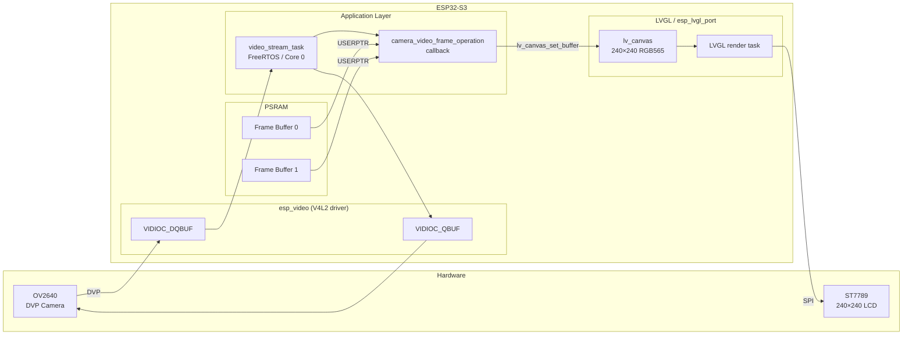

# Architecture: ESP32-S3-EYE Camera Display

## Overview

The application captures frames from the OV2640 camera via the DVP interface, streams them through a V4L2-compatible driver into PSRAM frame buffers, and renders them on the ST7789 LCD using LVGL. All capture and display work runs on Core 0 inside a dedicated FreeRTOS streaming task.

## System Diagram

## Component Breakdown

| Layer | Component | Role |
|-------|-----------|------|
| BSP | `espressif/esp32_s3_eye` | Board-level init: camera power, display SPI, backlight, BSP macros (`BSP_CAMERA_DEVICE`, `BSP_LCD_H_RES`, `BSP_LCD_V_RES`) |
| Camera driver | `espressif/esp_video` | V4L2-compatible DVP capture driver; provides `/dev/video*` device node |
| Display / UI | `espressif/esp_lvgl_port` + LVGL 9.x | LVGL port for ESP-IDF; manages display flush task and `bsp_display_lock()` |
| App — video | `app_video.c` / `app_video.h` | V4L2 device open, format negotiation, flip controls, mmap buffers, streaming FreeRTOS task |
| App — main | `main.c` | Orchestration: display init, PSRAM buffer alloc, LVGL canvas, video open, stream start |

## Data Flow

1. `app_video_open()` opens `BSP_CAMERA_DEVICE`, sets `V4L2_PIX_FMT_RGB565`, applies vflip/hflip via `VIDIOC_S_EXT_CTRLS`.
2. `app_video_set_bufs()` calls `VIDIOC_REQBUFS` (MMAP mode) + `VIDIOC_QBUF` to enqueue all buffers. The MMAP pointers are in PSRAM (allocated by `heap_caps_aligned_calloc(..., MALLOC_CAP_SPIRAM)`).
3. `app_video_stream_task_start()` calls `VIDIOC_STREAMON`, then spawns `video_stream_task` pinned to Core 0.
4. Each iteration of `video_stream_task`:
   - `VIDIOC_DQBUF` — dequeue a filled frame
   - invoke the registered `camera_video_frame_operation` callback
   - `VIDIOC_QBUF` — return the buffer to the driver
5. Inside the callback, `lv_canvas_set_buffer()` points the LVGL canvas at the incoming RGB565 frame; `lv_obj_invalidate()` schedules a redraw. The display flush runs independently in the LVGL port task.

## Key Design Decisions

- **No software scaling**: `CONFIG_CAMERA_OV2640_DVP_RGB565_240X240_25FPS=y` makes the sensor output exactly 240×240 px in RGB565, matching the LCD resolution. The raw camera buffer goes directly to LVGL with zero CPU cost.
- **PSRAM frame buffers**: camera buffers are allocated in PSRAM with cache-line alignment (`esp_cache_get_alignment`) to satisfy DMA requirements.
- **Double-buffering**: two buffers (`NUM_BUFS = 2`) allow the driver to capture the next frame while the previous one is being displayed.
- **V4L2 ctrl class**: `V4L2_CTRL_CLASS_USER` (not `V4L2_CID_USER_CLASS`) is used for flip controls — this is correct per the V4L2 specification.

## Source Files

| File | Description |
|------|-------------|
| `main/main.c` | App entry point — GPIO LED off, display/camera init, PSRAM alloc, LVGL canvas, stream start |
| `main/app_video.c` | V4L2 implementation — open/format/flip/mmap/stream task |
| `main/app_video.h` | Public API using `V4L2_PIX_FMT_*` constants from `linux/videodev2.h` |
| `main/CMakeLists.txt` | `idf_component_register(SRCS "main.c" "app_video.c" INCLUDE_DIRS ".")` |
| `main/idf_component.yml` | BSP dependency: `espressif/esp32_s3_eye: ^6.0.0` |
| `sdkconfig.defaults` | All required Kconfig defaults (PSRAM, OV2640, CPU speed, LVGL) |
| `CMakeLists.txt` | Top-level: `set(COMPONENTS main)` + `project(esp32s3-eye)` |
