# Face Recognition App

## Goal

Change the default application for human face recognition `face-recognition` to **turn on the green LED only when a recognized (enrolled) face is detected**, while keeping
LCD detection boxes and recognition labels working.

Target board: **ESP32-S3-EYE**
Target file to change: **`main/app_main.cpp`**
Do **not** modify esp-who component sources unless explicitly instructed.

## Prerequisites

Before starting, the agent should confirm:

- [ ] Project builds and flashes for `esp32s3`
- [ ] `main/idf_component.yml` depends on `esp32_s3_eye`
- [ ] `sdkconfig` has `CONFIG_IDF_TARGET_ESP32S3=y`
- [ ] Stock app shows camera feed, face bounding boxes, and button-based enroll/recognize

Useful reference paths (outside this repo):

| Resource | Path |
|----------|------|
| Original esp-who example | `esp-who/examples/human_face_recognition/main/app_main.cpp` |
| LCD app base class | `esp-who/components/who_app/who_recognition_app/who_recognition_app_lcd.hpp` |
| Recognition task logic | `esp-who/components/who_recognition/who_recognition.cpp` |

## Architecture

```mermaid
flowchart TD
    A[Camera frame] --> B[Detect task<br/>runs every frame]
    B --> C[detect_result_cb&#40;&#41;<br/>red bounding boxes on LCD]
    B --> D[Trigger RECOGNIZE event<br/>our addition, throttled]
    D --> E[Recognition task<br/>one-shot per event]
    E --> F[recognition_result_cb&#40;&#41;<br/>LCD label + LED]
```

| Term | Meaning |
|------|---------|
| **Detection** | "A face is visible" (`result.det_res` not empty) |
| **Recognition** | "This face matches someone in `face.db`" (result contains `sim:`) |
| **Unknown face** | Detection succeeded but no DB match (`"who?"`) |

Hardware buttons on ESP32-S3-EYE:

Keep the same keys function:

| Button | Action |
|--------|--------|
| UP | Enroll face |
| PLAY | Manual recognize |
| DOWN | Delete last enrolled face |

## Step 1 — Clean the starting `app_main.cpp`

### Goal

Simplify the stock example to ESP32-S3 only. Remove ESP32-P4 conditionals and dead code.

### Requirements

- Clean up main/app_main.cpp and remove all ESP32-P4 defines.
- Keep ESP32-S3 only: fatfs flash mount, LED init (off), DVP frame pipeline, and WhoRecognitionAppLCD. Do not add custom classes yet.

### Verification

- [ ] No `CONFIG_IDF_TARGET_ESP32P4` or P4 pipeline references in `app_main.cpp`
- [ ] Project still builds
- [ ] App runs: LCD shows camera + detection boxes; PLAY button triggers recognition

## Step 2 — LED on any face detection

### Goal

Introduce a subclass of `WhoRecognitionAppLCD` and light the LED whenever **any** face is detected.

### Requirements

- In `main/app_main.cpp`, create a class `WhoRecognitionAppLCDWithCallback` that extends `WhoRecognitionAppLCD`.
- Override `detect_result_cb`:
  - If `result.det_res` is not empty: log "Face detected!" and turn BSP_LED_GREEN on.
  - If `empty`: turn BSP_LED_GREEN off.
  - Always call the parent `detect_result_cb` to keep LCD bounding boxes working.
- Use `WhoRecognitionAppLCDWithCallback` in `app_main` instead of `WhoRecognitionAppLCD`.
- Keep `bsp_leds_init()` and `bsp_led_set(BSP_LED_GREEN, false)` in `app_main`.

### Verification

- [ ] LED turns on when any face is in frame
- [ ] LED turns off when no face is in frame
- [ ] LCD bounding boxes still appear

## Step 3 — Light the LED only for recognized faces

### Goal

Move LED **on** logic from detection to recognition. LED should light only for enrolled identities.

### Requirements

- Update `WhoRecognitionAppLCDWithCallback` in `main/app_main.cpp`:
- Remove LED-on logic from `detect_result_cb`. Only turn the LED off when `result.det_res` is empty.
- Override `recognition_result_cb`:
  - If result contains "face recognized": log and turn BSP_LED_GREEN on.
  - If result is exactly "who?" (unknown face): turn BSP_LED_GREEN off.
  - Do not change LED for enroll/delete messages.
- Always call parent `recognition_result_cb` to keep the LCD name label working.

### Verification

- [ ] Enroll a face with UP button
- [ ] Press PLAY: LED turns on for enrolled face
- [ ] Unknown face: LED stays off (may require PLAY button at this step)
- [ ] LCD shows `id: N, sim: X.XX` for known faces and `who?` for unknown

## Step 4 — Automatic recognition

### Goal

Trigger recognition automatically when a face is detected. No button needed.

### Requirements

- In `WhoRecognitionAppLCDWithCallback`, add automatic recognition:
  - Add `using namespace who::recognition;`
  - Add a private `trigger_recognition()` method that sets `WhoRecognitionCore::RECOGNIZE` on the recognition task event group (use `m_recognition->get_recognition_task()`).
- In `detect_result_cb`, when a face is present (`result.det_res` not empty), call `trigger_recognition()`.
- Do not re-trigger recognition inside `recognition_result_cb` yet.

### Verification

- [ ] After enrolling with UP, LED turns on automatically when enrolled user faces the camera
- [ ] Unknown face: LED stays off without pressing PLAY

## Step 5 — Callback registration (virtual override bypass)

### Goal

Ensure subclass overrides are actually invoked by esp-who tasks.

### Requirements

In WhoRecognitionAppLCDWithCallback constructor, re-register callbacks with lambdas so our overrides are called. The base class uses std::bind to WhoRecognitionAppLCD methods which bypasses virtual dispatch.

### Verification

- [ ] LED and logs respond without needing PLAY button
- [ ] Serial shows `DETECTION` / `RECOGNITION` logs from custom callbacks

## Step 6 — Add explanatory comments

### Goal

Document the code for future developers and agents.

### Requirements

- Add relevant comments to `main/app_main.cpp` explaining:
  - The detect vs recognition pipeline
  - Why callbacks are re-registered in the constructor
  - What recognition result strings mean ("sim:", "who?")
  - Why parent class methods must still be called
- Keep comments concise; do not change behavior.
- Use Mermaid flows when needed.

### Verification

- [ ] Class-level comment describes camera → detect → recognize → LCD/LED flow
- [ ] Constructor comment explains std::bind / virtual dispatch issue
- [ ] Throttle comment explains detection stall prevention

---

## Final acceptance criteria

The agent is done when **all** of the following are true:

| # | Criterion |
|---|-----------|
| 1 | Only `main/app_main.cpp` was modified (unless Step 0 also cleaned other files per prompt) |
| 2 | `WhoRecognitionAppLCDWithCallback` extends `WhoRecognitionAppLCD` |
| 3 | Callbacks re-registered in constructor with `[this]` lambdas |
| 4 | LED on when result contains `"sim:"` |
| 5 | LED off when result is `"who?"` or no face in frame |
| 6 | Recognition auto-triggered on face detection, throttled to 500 ms |
| 7 | Parent callbacks always called (LCD boxes + label still work) |
| 8 | No continuous re-trigger from `recognition_result_cb` or `run()` |
| 9 | Project builds for ESP32-S3 |
| 10 | Comments explain the non-obvious design decisions |
