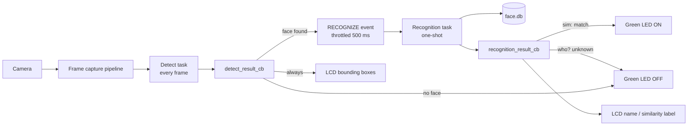
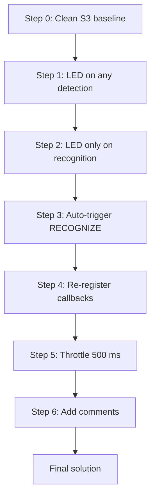
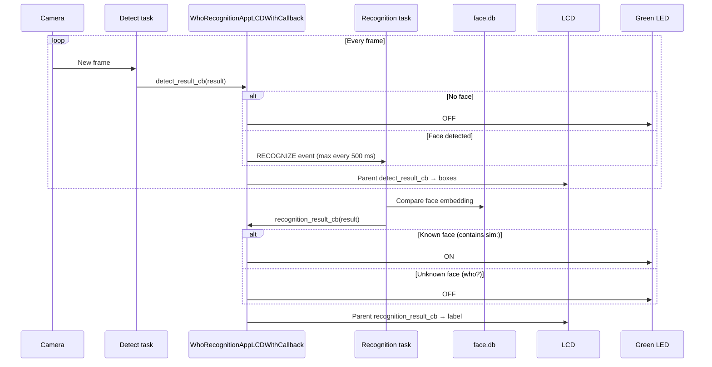
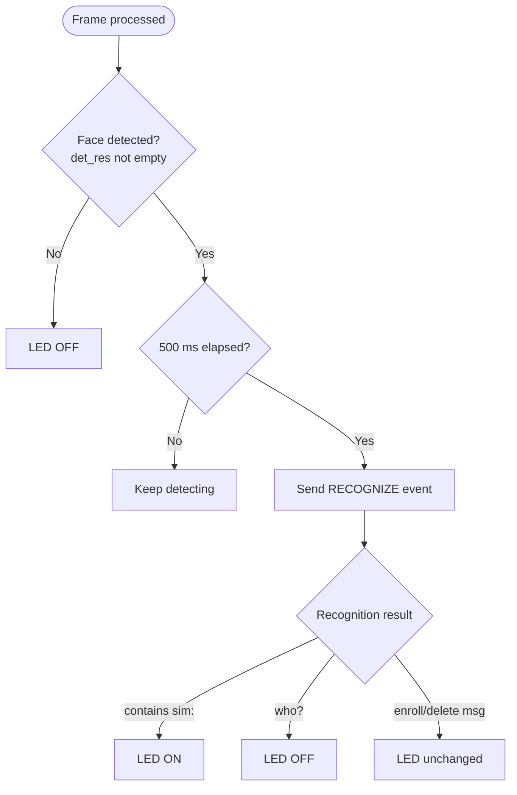
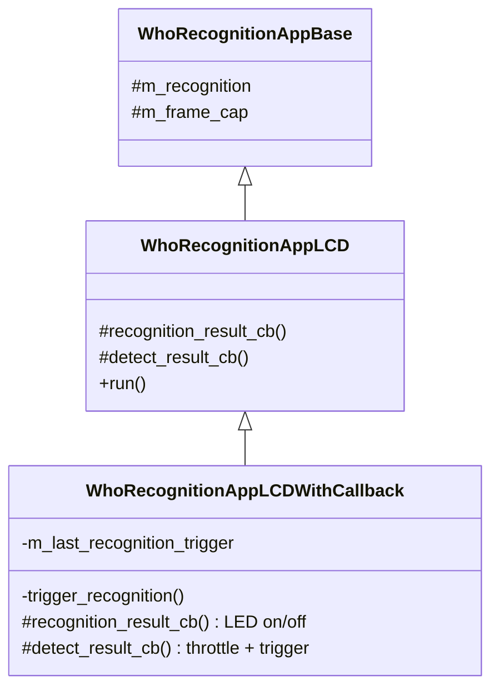

# Face Recognition LED — Architecture

Target board: **ESP32-S3-EYE**  
Main file: **`main/app_main.cpp`**

---

## High-level pipeline

---

## Workshop step progression

---

## Callback flow

---

## LED decision logic

---

## Class structure

---

## Key concepts

| Term | Meaning |
|------|---------|
| **Detection** | A face is visible in the frame (`result.det_res` not empty) |
| **Recognition** | The face matches someone enrolled in `face.db` (result contains `sim:`) |
| **Unknown face** | Face detected but not in database (result is `"who?"`) |
| **RECOGNIZE event** | FreeRTOS event bit that tells the recognition task to run one identity check |

## Hardware buttons (ESP32-S3-EYE)

| Button | Action |
|--------|--------|
| UP | Enroll current face into `face.db` |
| PLAY | Manual recognize (optional after auto-trigger is added) |
| DOWN | Delete last enrolled face |
